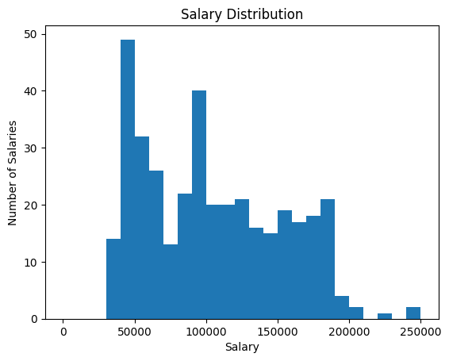
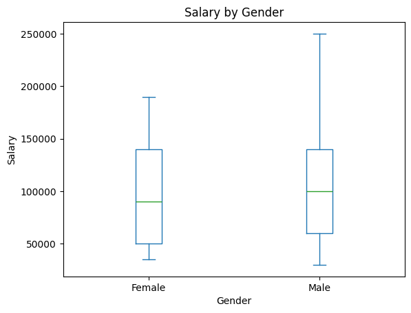
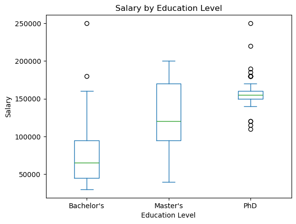
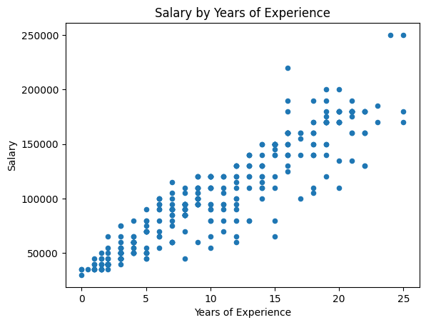

# Salary Prediction with Linear Regression

## Summary
The analysis showed experience, title, education, and gender were all significant when it came to predicting salary. The two strongest effects were years of experience and education. The model shows an increase of \$5,081 annually per year of experience, and an increase of \$23,137 for a PhD over a bachelor's. The analysis also showed that holding all variables constant, men earned about \$7,800 than women.

## Question
Can we predict an employe's salary based on thei age, gender, education level, job title, or years of experience?

## Data
The salary raw dataset contains 375 employees along with their characteristics. The salaries in the raw dataset ranged from \$350 to \$250,000. The dataset contained the following data types:

| Column Name | Data Type |
|:--- |:---|
| Age | float |
| Gender | string |
| Education Level | string |
| Job Title | string |
| Years of Experience | float |
| Salary | float|

## Approach
### Cleaning
Because the dataset was small, I focused on retaining as many rows as possible. I dropped missing values, as they made up a negibile amount of the dataset. I also dropped the smallest salary value as it appeared to be an error in this context. Additionally, I standardized column names to make the dataset easier to work with and converted `job_titles` to lowercase for similar reason. I chose to leave outliers, as they're relevant to the research question.

### Data Exploration
To get a sense of the data, I viewed descriptive statistics for all variables. A graph `salary` showed that the distribution was multimodal. Salaries clustered around certain numbers, with the largest peak in the \$40-50k bin, and a second large peak around \$95k. The graph shows a steep decline in the number of salaries at around \$190k. The data also has a slight right skew.

The dataset showed evidence that male salaries were higher than famale salaries. The average salary for men was around 8% higher than for women. The median salary for men was around 11% higher than for women. 

 

The data also showed evidence that salaries are higher for increased education. The median salary for a master's degree was about 85% higher than for a bachlor's degree. The median salary for a doctorate was about 138% higher than for a bachelor's degreen and about 29% higher than for a master's degree.

 

There was also evidence that salaries are associated with increased eyars of experience.A correlation of 0.93 indicates a strong, postive correlation. The scatterplot also shows that salaries grow along with years of experience.

 

### Encoding
`job_title`, `gender`, and `education_level` were encoded to make these fields available for analysis. `job_title`s were grouped into catefories by keywords and given 0/1 values. `gender` was assigned via the `is_male` flag with 1 indicating males and 0 indicating female. `education_level` columns were given an `edu` prefix, changed to lowercase, and encoded with dummy values. All these changes were done because the OLS model cannot interpret categorical values. It requires numeric data.

## Analysis
The analysis was performed using `statsmodels` OLS. Initially, 

## Results

## Assumptions and Limitations
* residuals spread for high earners

## Next Steps

## How to Reproduce